<!--- _paginate: false--->
<!--- _class: invert--->

#  <!--- fit ---> The Language Analysis Portal
#  🎨 🏗 💡Design, implementation and use

> **Emanuele Lapponi** (he/him)
> Language Technology Group
> Institute for Informatics
> University of Oslo
>  `@emanlapponi`

---

# 💡 The digital Social Sciences and Humanities (SSH)

- Interest in computational methods has grown substantially in the last decade
- One strain of digital SSH: research built on "more data than you can read"
- NLP tools are becoming an integral part of research outside of CS and Linguistics


---

# CLARIN

- Develop an infrastructure to facilitate NLP ❤️ SSH research
- Part of the CLARINO mandate: build a portal for NLP applications focusing on users with no NLP background


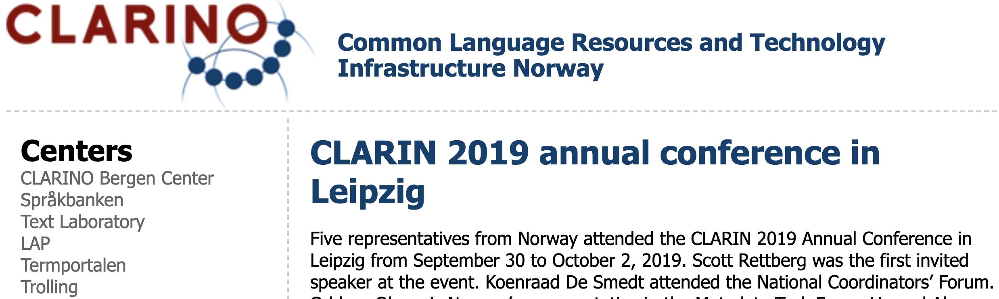

---

### 🤔 Undertaking such a project raises questions:

- How should a system the facilitates NLP tools use be designed?
- Can off-the-shelf tools be integrated? 
- What's a good/scalable/coherent way to do it?
- And what's the point?

---

<!--- _paginate: false--->
<!--- _class: invert--->

## Part 1
# Political Science & Text-as-data 💡

---
# <!--- fit ---> 💡 Classifier evaluation scores as a quantity of interest

- In a parliamentary setting, the contents of a speech should reflect the
ideology of the speaker.
- Use party classification scores for parliamentary analysis!

---
### For example: Measure polarization

- Higher accuracy → more polarized*
- Hirst et al** do it for the Canadian Parliament
    - and find that position is a much stronger signal than policy!

### ...Or ask more involved questions

- Are newcomers to the EU parliament joining groups based on ideology or convenience?***

<!--- _footer: '

* [Classification Accuracy as a Substantive Quantity of
Interest: Measuring Polarization in Westminster
Systems](https://www.nyu.edu/projects/spirling/documents/PolLetter.pdf)

** [Party Status as a Confound in the Automatic Classification of Political Speech by Ideology.](https://pdfs.semanticscholar.org/e3c5/8ec78ea408e165857709d131dc76b48b1e02.pdf?_ga=2.90516889.224407089.1573656100-759081113.1570025983) 

*** [Lost in Translation? Predicting Party Group Affiliation from European Parliament Debates](https://pdfs.semanticscholar.org/398d/b35d1d50f96df6f7d841b23960a9979b8066.pdf?_ga=2.160769342.224407089.1573656100-759081113.1570025983)' --->


---
# Text-as-data pre-processing cookbook

- 🏅 Grimmer and Stewart (2013)* survey the text-as-data field, warning of the dangers of "one-size-fits-all" experiments
- 🤔 They also introduce a recipe for pre-processing, with emphasis on stemming and normalization
- 🙄 Dismissal of expensive techniques that "do little to enhance performance", e.g. context, disambiguation, lemmatization and so on

<!--- _footer: '* [Text as Data: The Promise and Pitfalls of Automatic Content
Analysis Methods for Political Texts](https://web.stanford.edu/~jgrimmer/tad2.pdf)' --->

---
# Text-as-data pre-processing cookbook

- The recipe becomes gospel
- Even attempts to address the effects of pre-processing on political analysis provide alternate recipes using the same ingredients*
- Experiments miss out on potentially useful (and contentfully significant) tools and techniques!

<!--- _footer: '* [Text Preprocessing For Unsupervised Learning: Why It Matters, When It Misleads, And What To Do About It](https://www.cambridge.org/core/journals/political-analysis/article/text-preprocessing-for-unsupervised-learning-why-it-matters-when-it-misleads-and-what-to-do-about-it/AA7D4DE0AA6AB208502515AE3EC6989E)' --->

---
<!--- _paginate: false--->
<!--- _class: invert--->
<!--- _header: '' --->

## Part 2
#  LAP & LXF 🎨 🏗

---
<!--- header: '🎨🏗 LAP & LXF' --->

# The Language Analysis Portal
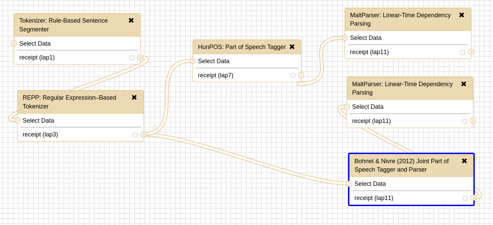

---
## **L**ap e**X**change **F**ormat

- Scalable to linguistic annotations beneath and above the token level
- Applicable to a wide a range of linguistic phenomena and text annotations
- Scalable to large data volumes

---
## The **L**anguage **A**nnotation **F**ramework*

An abstract data model: represent arbitrary text **annotations** in a graph. **Nodes** and **edges** organize the structure and the relations of the annotations, and refer to **regions** in the original data.
- Purpose: full interoperability across annotation formats.
- Machine readable instantiations of the data model exist, but are focused on _representation_ rather than _interchange_.

<!--- _footer: '* [The Linguistic Annotation Framework. A Standard for Annotation Interchange and Merging](https://link.springer.com/article/10.1007/s10579-014-9268-1)' --->

---

- **LXF** builds on and expands LAF, focusing on intermediate graph representations and building a graph incrementally
- Achieves scalability, both representational and computational, while staying faithful to the original design


---

<!--- _paginate: false--->
<!--- _class: invert--->
<!--- _header: '' --->

## Part 4
#  The Talk of Norway 💡

---
<!--- header: '💡 The Talk of Norway' --->

# `https://github.com/ltgoslo/talk-of-norway`

- 18 years of speeches from the Norwegian Parliament, in a novel combination of 80+ meta data variables and language, sentence, token, lemma, PoS and morphology annotations

- An open, plug-and-research resource for text-as-data experimentation

---
# <!--- fit ---> F1 as a quantity of interest, in Norway

- Marked improvements with better normalization, disambiguation and context
- Mixing linguistic and meta-data features helps, too
- Pre-processing does matter for the substance of the analysis

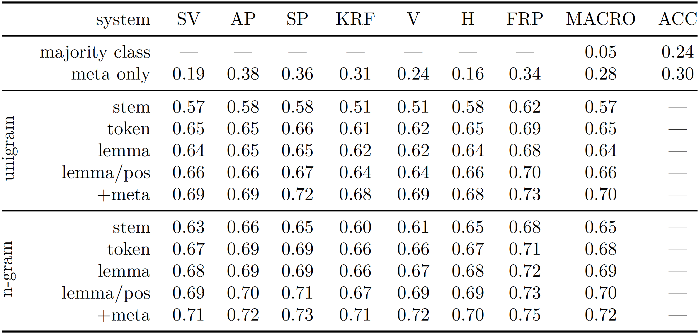

---

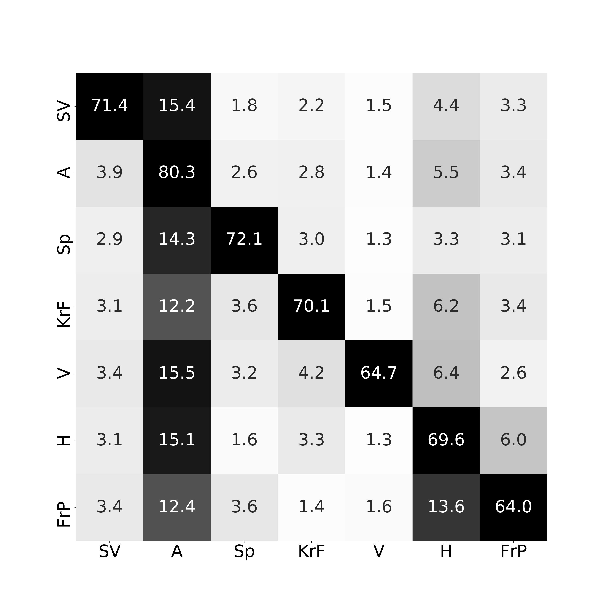
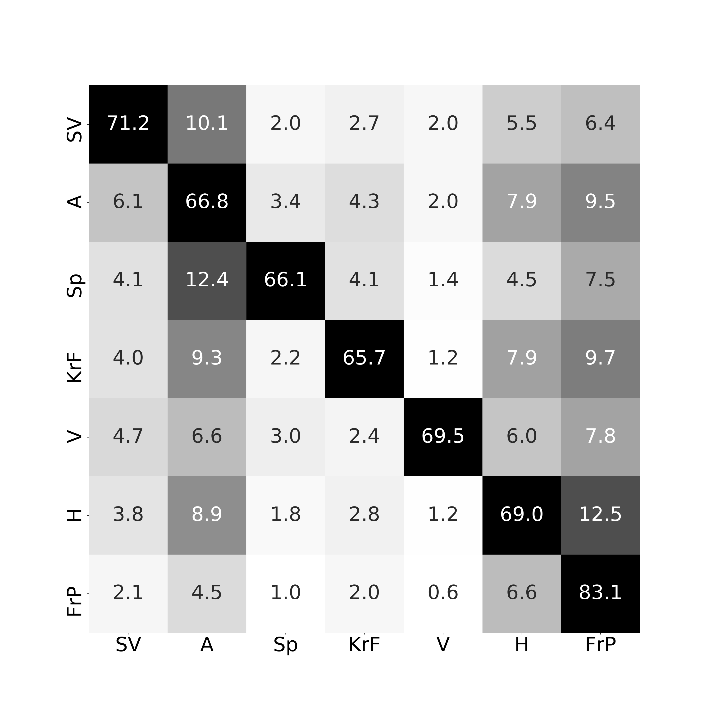

---
<!--- _paginate: false--->
<!--- _class: invert--->
<!--- _header: '' --->

# Conclusions ✨

---
<!--- header: '📋 Conclusions and future work' --->

- Heterogenous workflows of off-the-shelf NLP tools can be made easily accessible without sacrificing scalability and flexibility
- Easy access to NLP pre-processing tools benefits political research and analysis

---

# 🎨 🏗 LAP & LXF 
- A modular system for HPC-ready, user friendly language annotations
- Scalable to large volumes of data and heterogenous linguistic (and non-linguistic!) annotation

---

# 💡 Talk of Norway
- An open resource for parliamentary analysis, informed by and developed with Political Scientists
- The first ToN experiments show substantive differences in the analyses built on party classification performance

---
<!--- _header: '' --->

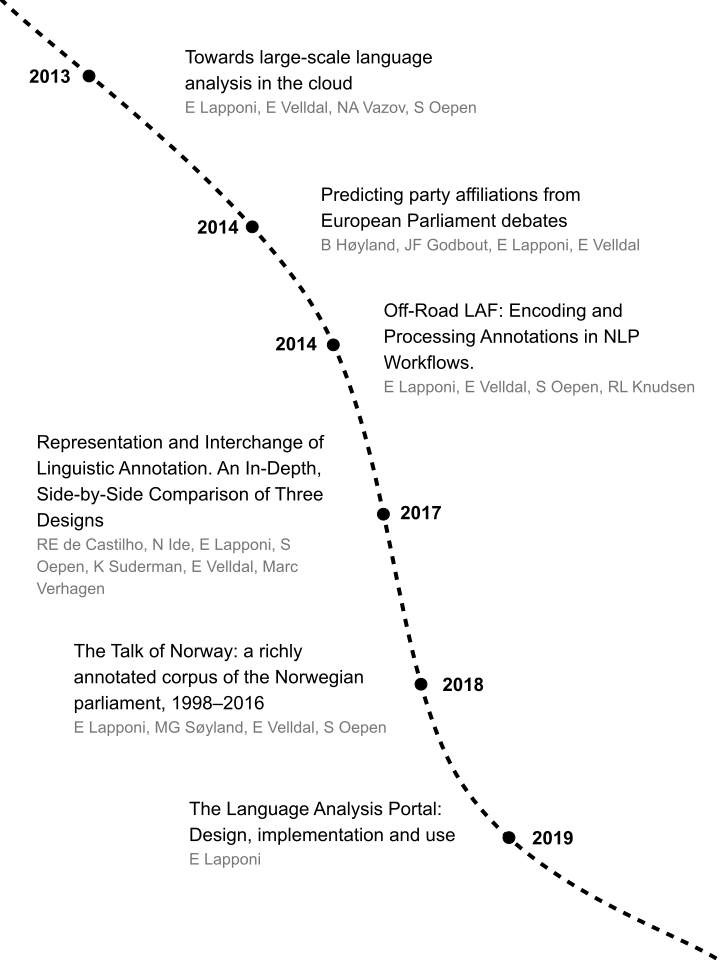

# Defense! ⛹🏻‍♂️ 🎓

---
<!--- _class: invert --->
<!--- header: 'extras' --->

# Director's cut 🎬

---
<!--- header: '💡 Text as data' --->

### Using **NLP** techniques for political analysis

- For example: place words on a left-right political axis*

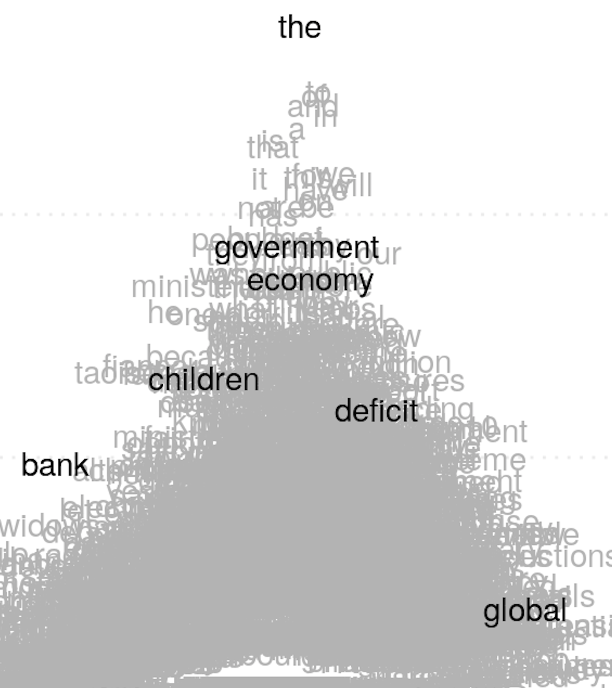
<!--- _footer: '* [A Scaling Model for Estimating Time-Series Party
Positions from Texts](http://www.wordfish.org/uploads/1/2/9/8/12985397/slapin_proksch_ajps_2008.pdf)' --->

---

# Getting our feet wet

- Preliminary experiments, going off the recipe
- Signs that linguistic features might contribute positively to these methods

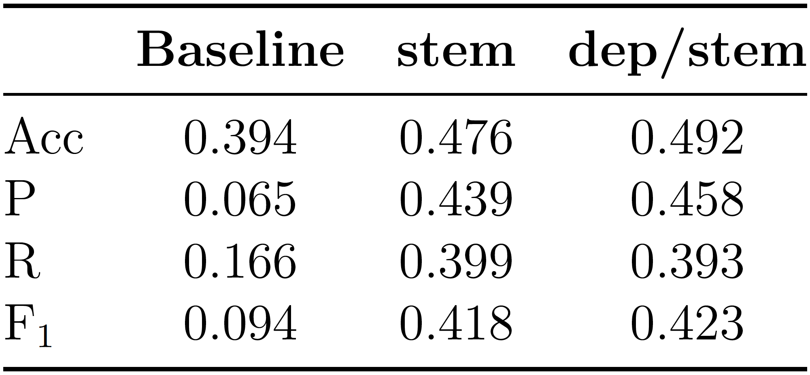

<!--- _footer: '* [Predicting Party Affiliations from European Parliament Debates](https://www.aclweb.org/anthology/W14-2516.pdf)' --->

---

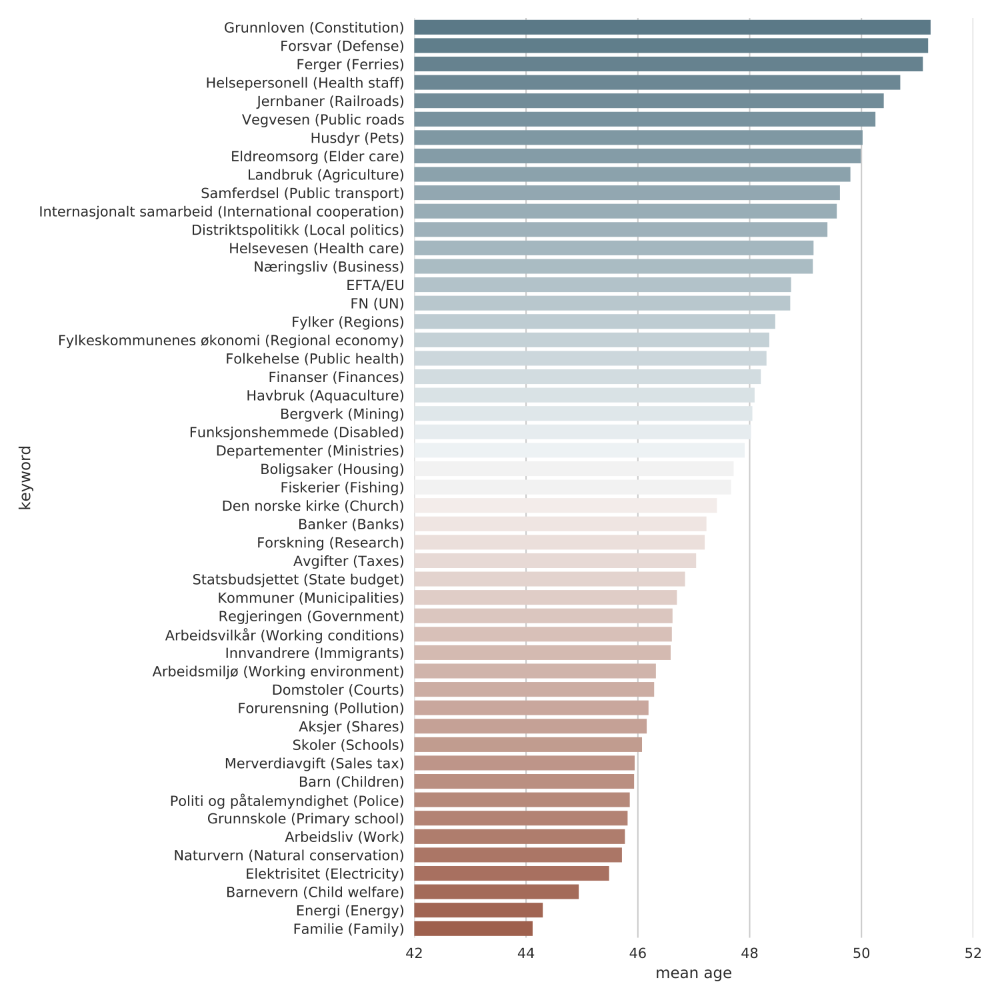 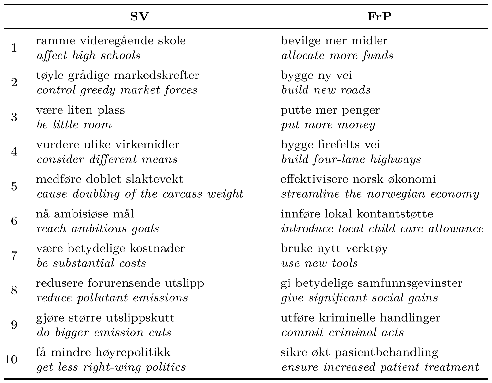

On their own, the meta data variables are useful for statistics (what do younger vs. older MEP talk about?), and can be used in combination with the linguistic annotations to quickly go from raw data to policies

---

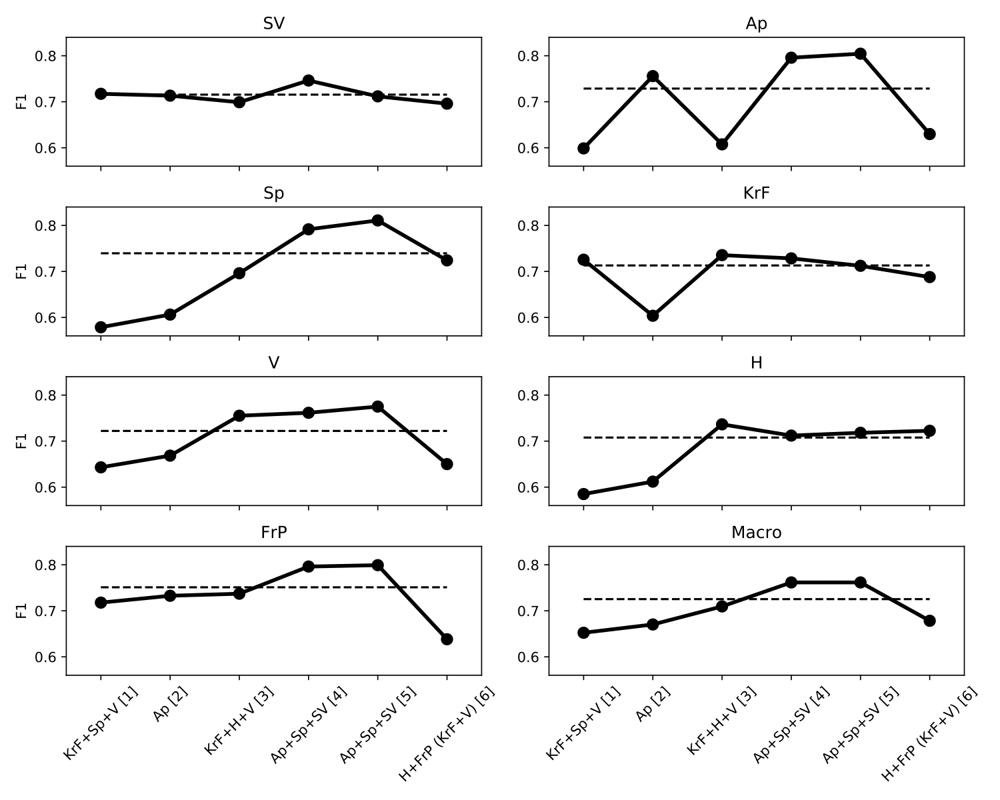

---

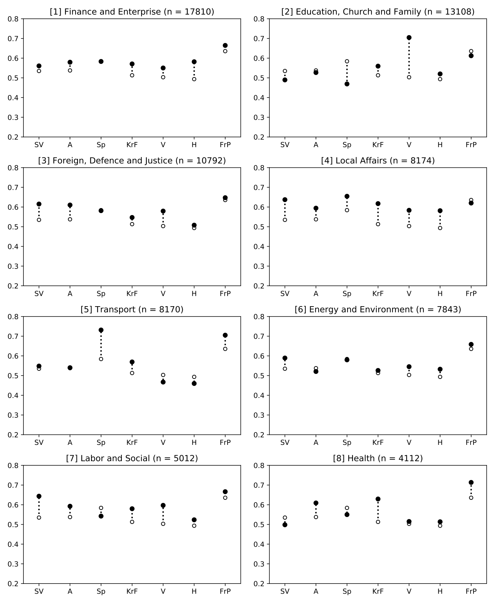

---

# What is an NLP tool?

- Tokenizers, PoS taggers, lemmatizers, syntactic parsers +++
- Come in many flavors, adhere to different traditions, have different pros and cons (depending on the task)
- It's a good idea to test different tools before settling for one for a given task!

---
# Tool interoperability and interchange formats

```shell
 Sandy NNP
 barks NNS
 .     .
```

```shell
 1 Sandy _ _ NNP _ _ _ _ _
 2 barks _ _ NNS _ _ _ _ _
 3 .     _ _ . _ _ _ _ _
```

```shell
 1 Sandy _ _ NNP _ 2 nn    _ _
 2 barks _ _ NNS _ 0 null  _ _
 3 .     _ _ .   _ 2 punct _ _
```
---
# What is a workflow?

- Combine tools to get annotations for some downstream task (linguistic or otherwise)
- Tools better be compatible


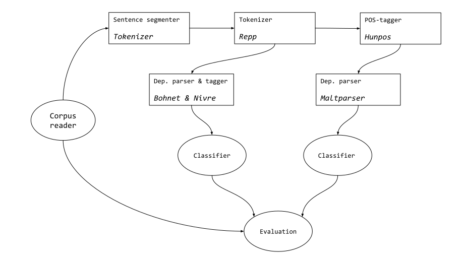

---
## What is a portal?

- No local installation is required
- Data upload and results download
- Graphical user interface to configuring and running tools
- Not developer tools like **NLTK** and **SpaCy**!

## What is big data?
- Big enough to make processing it on a laptop impractical

---

# LAP Architecture

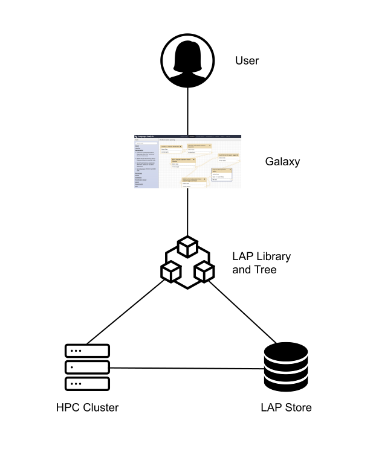

---

## Graphical user interface

- LAP is GUI agnostic
- Blazing the trail for using Galaxy for NLP

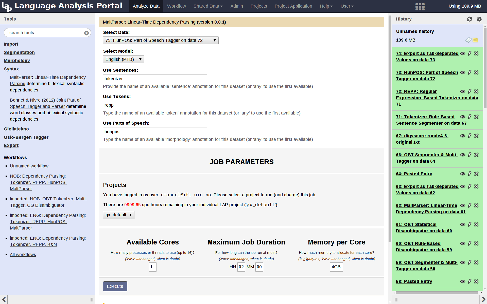

---

```json
{
    "annotations": {
        "morphology": [
            "hunpos"
        ], 
        "sentence": [
            "nltk_punkt"
        ], 
        "token": [
            "repp"
        ]
    }, 
    "annotators": {
        "hunpos": "26a43d0c-f3db-11e8-b17a-00259075dac6",
        "nltk_punkt": "1d112232-f3db-11e8-a3ee-00259075db92", 
        "repp": "20aaddc0-f3db-11e8-b01c-b083fed3d77f"
    }, 
    "media": {
        "text": "0d3b5012-f3db-11e8-91a5-b083fed3d77f"
    }, 
    "receipt_origin": "hunpos"
}
```

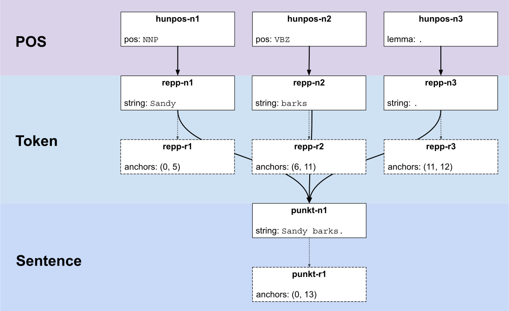

---
# Our perspective

- Thoroughly navigating the NLP sea before doing political analysis means no
political analysis 
- Building NLP-for-SSH infrastructures might just be a good idea
- Doing it without navigating the SSH sea likely is not: if we build it, will they come?

