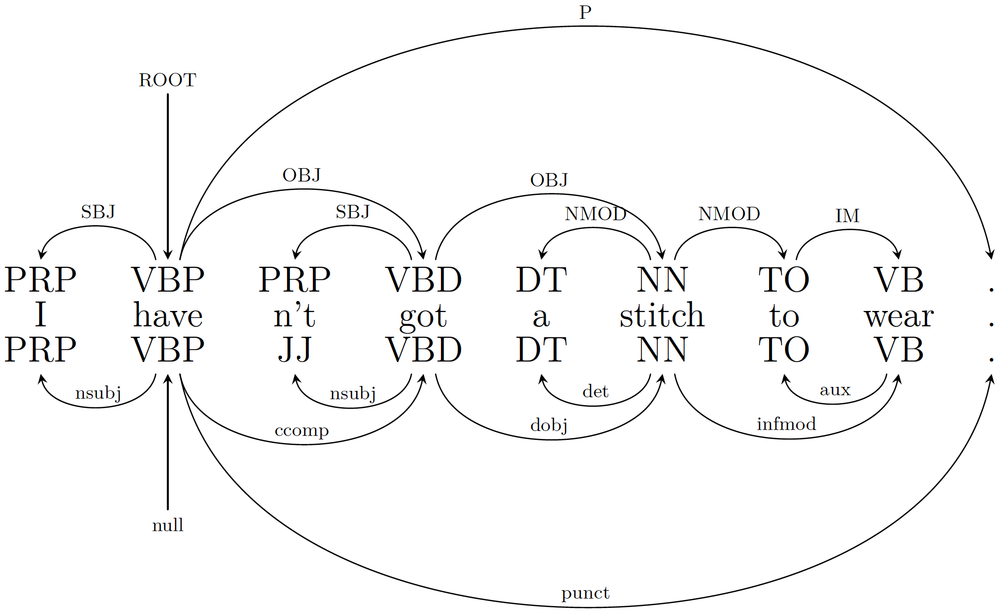
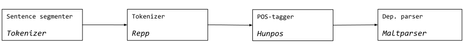
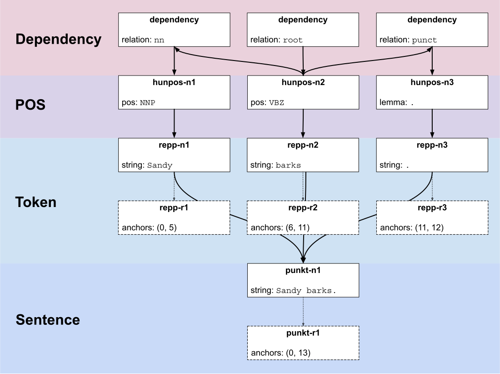

<!--- _paginate: false--->
<!--- _class: invert--->
<!--- _footer: ':memo: Find this deck at `github.com/emanlapponi/defense/slides.md`' --->

#  <!--- fit ---> The Language Analysis Portal
#  🎨 🏗 💡Design, implementation and use

**Emanuele Lapponi**
> Language Technology Group
> Institute for Informatics
> University of Oslo
>  `@emanlapponi`

---

# Backdrop

International efforts to develop systems that aim at facilitating NLP-based research in traditionally non-technical fields, such as the Social Sciences and the Humanities.


---

<!---
# Questions

- What kind of annotations and processing tools are needed by the end users?
- How should the system be designed? 
- Can off-the-shelf NLP tools, with their different input and output representations, be integrated into a coherent platform?
- Can we balance ease of use with scalability to potentially large data volumes? 
- And, crucially, is the kind of processing provided by these platforms useful to the target audience?

--->

We initiate a collaboration with the Department of Political Science, gather requirements by partaking in parliamentary analysis using NLP methods, design and implement a portal for facilitating access to NLP tools, and validate our efforts through Political Science research.


---

<!--- _paginate: false--->
<!--- _class: invert--->

## Part 1
# Text-as-data 💡

---
<!--- header: '💡 Text as data' --->

### Using **NLP** for political analysis

- Typically, empirical inference in PolSci is based on numerical data
- (Relatively) recently, text has seen a surge of interest in the field
- For example, a lot of work uses `Wordfish`* to place words on a left-right political axis 


<!--- _footer: '* [A Scaling Model for Estimating Time-Series Party
Positions from Texts](http://www.wordfish.org/uploads/1/2/9/8/12985397/slapin_proksch_ajps_2008.pdf)' --->

---
# Classifier evaluation scores as a quantity of interest

- In a parliamentary setting, the contents of a speech should reflect the
ideology of the speaker.

- Use party classification scores for parliamentary analysis!

---
### Measure polarization

- Higher accuracy → more polarized
- Hirst et al* do it for the Canadian Parliament
    - and find that position is a much stronger signal than policy!
- Peterson and Spirling** do it for the English Parliament over ~80 years


### ...Or ask more involved questions

- Are newcomers to the EU parliament joining groups based on ideology or convenience?***

<!--- _footer: '
* [Party Status as a Confound in the Automatic Classification of Political Speech by Ideology.](https://pdfs.semanticscholar.org/e3c5/8ec78ea408e165857709d131dc76b48b1e02.pdf?_ga=2.90516889.224407089.1573656100-759081113.1570025983) 

** [Classification Accuracy as a Substantive Quantity of
Interest: Measuring Polarization in Westminster
Systems](https://www.nyu.edu/projects/spirling/documents/PolLetter.pdf)

*** [Lost in Translation? Predicting Party Group Affiliation from European Parliament Debates](https://pdfs.semanticscholar.org/398d/b35d1d50f96df6f7d841b23960a9979b8066.pdf?_ga=2.160769342.224407089.1573656100-759081113.1570025983)' --->


---
# Text-as-data pre-processing cookbook

- Grimmer and Stewart (2013)* ignite the text-as-data field. They introduce a recipe for pre-processing, and warn of the dangers of "one-size-fits-all" experiments
- Emphasis on stemming and normalization
- Dismissal of expensive techniques that do little to enhance performance, e.g. ngram generation, lemmatization and so on

<!--- _footer: '* [Text as Data: The Promise and Pitfalls of Automatic Content
Analysis Methods for Political Texts](https://web.stanford.edu/~jgrimmer/tad2.pdf)' --->

---
# Text-as-data pre-processing cookbook

- The recipe becomes gospel
- Even attempts to mitigate the effects of pre-processing on political analysis provide a recipe using the same ingredients*
- Experiments miss out on potentially useful (and contentfully significant) tools and techniques!

<!--- _footer: '* [Text Preprocessing For Unsupervised Learning: Why It Matters, When It Misleads, And What To Do About It](https://www.cambridge.org/core/journals/political-analysis/article/text-preprocessing-for-unsupervised-learning-why-it-matters-when-it-misleads-and-what-to-do-about-it/AA7D4DE0AA6AB208502515AE3EC6989E)' --->

---
# Our perspective

- Thoroughly navigating the NLP sea before doing political analysis means no
political analysis 

- Building NLP-for-SSH infrastructures might just be a good idea

- Doing it without navigating the PolSci sea is not

---
# Getting our feet wet

- Preliminary experiments, going off the recipe
- signs that linguistic features might contribute positively to these methods


<!--- _footer: '* [Predicting Party Affiliations from European Parliament Debates](https://www.aclweb.org/anthology/W14-2516.pdf)' --->

---
<!--- _paginate: false--->
<!--- _class: invert--->
<!--- _header: '' --->

## Part 2
# Tools, workflows and portals 🎨

---
<!--- header: '🎨 Tools, annotations and portals' --->

# What is an NLP tool?

- Tokenizers, PoS taggers, lemmatizers, syntactic parsers +++
- Come in many flavors, adhere to different traditions, have different pros and cons (depending on the task)
- It's a good idea to test different tools before settling for one for a given task!

---



---
# Tool interoperability and interchange formats

```shell
 Sandy NNP
 barks NNS
 .     .
```

```shell
 1 Sandy _ _ _ _ _ _ _ _
 2 barks _ _ _ _ _ _ _ _
 3 .     _ _ _ _ _ _ _ _
```

```shell
 1 Sandy _ _ NNP _ 2 nn    _ _
 2 barks _ _ NNS _ 0 null  _ _
 3 .     _ _ .   _ 2 punct _ _
```
---
# What is a workflow?

- Combine tools to get annotations for some downstream task (linguistic or otherwise)
- Tools better be compatible



---


---
# What is a portal?

- No local installation is required
- Data upload and results download
- Graphical user interface to configuring and running tools

##### Not developer tools like **NLTK** and **SpaCy**

---
<!--- _paginate: false--->
<!--- _class: invert--->
<!--- _header: '' --->

## Part 3
#  LAP & LXF 🎨 🏗

---
<!--- header: '🎨🏗 LAP & LXF' --->

## Architecture

- These bulletpoints are intense
- Explain what the Library and the Tree are, and what do they enable
- Explain that we don't have time to go more in depth cuz we about to talk about LXF


---

## Graphical user interface

- LAP is GUI agnostic
- Blazing the trail for using Galaxy for NLP


---
# Workflows in Galaxy


---
## **L**ap e**X**change **F**ormat

- scalable to linguistic annotations beneath and above the token level
- applicable to a wide a range of linguistic phenomena and text annotations
- Scalable to large data volumes

---
## The **L**anguage **A**nnotation **F**ramework*

- **Regions**: Standoff references to the media being annotated
- **Graph elements**: A graph structure consisting of **nodes**, **edges** and **links** to regions, organizing the structure and the relations of the linguistic information
- **Annotations**: Feature structures containing the actual linguistic in- formation, associated with nodes and edges

<!--- _footer: '* [The Linguistic Annotation Framework. A Standard for Annotation Interchange and Merging](https://link.springer.com/article/10.1007/s10579-014-9268-1)' --->

---



---

```json
{
    "annotations": {
        "morphology": [
            "hunpos"
        ], 
        "sentence": [
            "nltk_punkt"
        ], 
        "token": [
            "repp"
        ]
    }, 
    "annotators": {
        "hunpos": "26a43d0c-f3db-11e8-b17a-00259075dac6",
        "nltk_punkt": "1d112232-f3db-11e8-a3ee-00259075db92", 
        "repp": "20aaddc0-f3db-11e8-b01c-b083fed3d77f"
    }, 
    "media": {
        "text": "0d3b5012-f3db-11e8-91a5-b083fed3d77f"
    }, 
    "receipt_origin": "hunpos"
}
```


---

<!---
# LXF, LIF & DKPROCore Type System

- **DKPROCore Type System** has the weakest support to provenance and alternative segmentations
- **LXF** is the interchange representation most faithful to LAF


--->

<!--- _paginate: false--->
<!--- _class: invert--->
<!--- _header: '' --->

## Part 4
#  The Talk of Norway 💡

---
<!--- header: '💡 The Talk of Norway' --->

# `https://github.com/ltgoslo/talk-of-norway`

- 18 years of speeches from the Norwegian Parliament, in a novel combination of 80+ meta data variables and language, sentence, token, lemma, pos and morphology annotations

- An open, plug-and-research resource for text-as-data experimentation

---

 

The meta data variables are useful on statistics (what do younger vs. older MEP talk about?), and can be used in combination with the linguistic annotations to quickly go from raw data to policies

---
# <!--- fit ---> F1 as a quantity of interest, feat. Norway

- Marked improvements with better normalization, disambiguation and context
- Mixing linguistic and meta-data features helps, too
- Pre-processing does matter for the substance of the analysis


---
<!--- _class: invert --->

# **Bonus content**
### Is classification accuracy driven by power or policy?
Using the meta-data variables, we re-evaluate our best predictions using meaningful subsets of the data
- `parl_period` 
- `party_role`
- `subject_committee_id`

---


---


---


---
<!--- _paginate: false--->
<!--- _class: invert--->
<!--- _header: '' --->

# <!--- fit ---> Conclusions and future work 🎨 🏗 💡

---
<!--- header: '📋 Conclusions and future work' --->

- we did
- we could have done

---