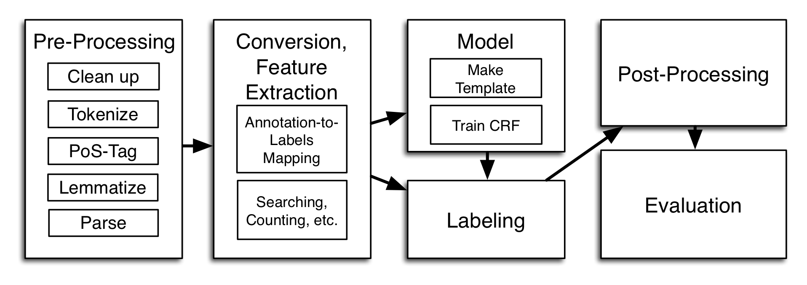

<!--- _class: invert --->
<!--- _paginate: false --->
# End-to-end systems in Natural Language Processing
## 👩🏻‍🔬 🧠  From feature extraction to Sesame Street
> **Emanuele Lapponi**
> Language Technology Group
> Institute for Informatics
> University of Oslo
> `@emanlapponi`

---
## 🤔 from-what-end-to-what-end NLP systems?

- Depends where you are starting from! Text? Speech? A picture, maybe?

- For non-research examples, you need not look further than your phone!


---
# ⚗️ End-to-end NLP experimental setups

- Typically going from text to some specific task, e.g.:
    - Question answering `(question,text) -> offsets`
    - Sentiment analysis `text -> sentiment`
    - Named entity recognition `text -> (label,offsets)`

- Today: NLP from 2012 to 2019, with Negation scope resolution 

---
# 🕵🏻‍♂️ 🔎 Negation Scope Resolution (NSR)

> Given a sentence and a negation cue (**not**, -**less**, **without**), which tokens are negated?

- If **{** he was **}** in the hospital and yet **not** **{** on the staff **}** he could only have been a house-surgeon or a house-physician.

- ... and **no** **{** one could have escaped our notice **}**.

---
# Negation Scope Resolution (NSR)

A natural* fit for sequence labeling

```txt
...
and     O
no      CUE
one     NEGATED
could   NEGATED
have    NEGATED
escaped NEGATED
our     NEGATED
notice  NEGATED
.
```

<!--- _footer: '* Arguably, deep semantic parsing is an even _more_ natural fit 🤔 Packard et al. 2014' --->

---
<!--- _class: invert --->
<!--- _paginate: false --->

## <!--- fit ---> 2012


---

# 👩🏻‍🔬 UiO2: Sequence-Labeling Negation with Dependency Features
> ###### Lapponi et al., 2012

- A Highly (over?) engineered system
- Uses the most fashionable tool of the time: CRFs
- But everyone has CRFs! What matters most here (and,  arguably, in NLP in general) is representation.

---

# Ye olde NLP pipeline



---

# What's a word?

A bunch of symbols: we decide what those symbols are, for instance:
- token `notice`
- part-of-speech disambiguated: `notice-NOUN`
- the backward trigram: `notice-our-escaped`
- might help to know that it's a direct object:`notice-dobj`

---

# What's a negated word?

The same as a normal word, but also:
- a right/left distance from a negation cue: `5`
- in a syntax (dependency) tree, a shortest path: `3`
- and a very specific symbol to represent it: `UP-dobj-DOWN-nsubj-DOWN-dep`
- Very, very sparse matrix


---

# Then, give the matrix to the model

Without diving into the specific, for intuition's sake:


### Ah ha! One more thing

Since the transitions have an effect on the model, experiment with more labels:
`[O, CUE, N, S]` - counterintuitive, but does the trick

---
<!--- _paginate: false --->

## <!--- fit ---> 2013


---

# Representation revisited

- All the engineering in the 2012 system gets us little in the way of actual **meaning**
- `house-surgeon` and `surgeon`
- How shall we know the meaning of a word, Dr Firth?

---


# <!--- fit ---> You shall know the meaning of a word by the company it keeps


---

# Word vectors

- Randomly initialize one vector per word
- Calculate a probability distribution of surrounding words (or the inverse)
- Neural watershed moment in NLP


---

# `todo`

- capture similarities (most similar)

- linguistic properties (fast, fastest, good --> best)

- for good and bad, society (some cool example)

---

# `todo`

- these dense representations turn out to make an RNN arch, LSTMs, work pretty damn well
- show a biLSTM animation going back and forward
- Word vectors are good at basic representation, biLSTMs great at catching nonlinearities
- like the w_i relation to a negated label, for instance

---
<!--- _paginate: false --->
<!--- _class: invert --->

## <!--- fit ---> 2016


---

# 🧠 Neural Networks For Negation Scope Detection
> ###### Fancellu et al., 2016

# `todo`

- show end-to-end architecture
- make a point of how much more simple (and elegant/intuitive?) it is
- compare results with UIO2

---

<!--- _paginate: false --->
<!--- _class: invert --->

## <!--- fit ---> 2018


---

# `todo`

- The problem with word vectors
- Maybe something that LSTMs can solve?
- enter deep contextualized embeddings
- ELMO paper
- show smashed leaderboards
- highlevel BERT, tractab. trick, caveats

---

<!--- _paginate: false --->
<!--- _class: invert --->

## <!--- fit ---> 2019


---

#   NegBERT: A Transfer Learning Approach for Negation Detection and Scope Resolution
> ###### Khandelwal and Sawant, 2019

# `todo`

- preprint paper from 3 weeks ago: https://arxiv.org/pdf/1911.04211.pdf
- show architecture, briefly explain the concept of tl/fine tuning (lego analogy?)
- Show the improvement on sherlock holmes 2012 through 2019

---

# `todo`

- closing slide

> "Everyone has Bert": now what?