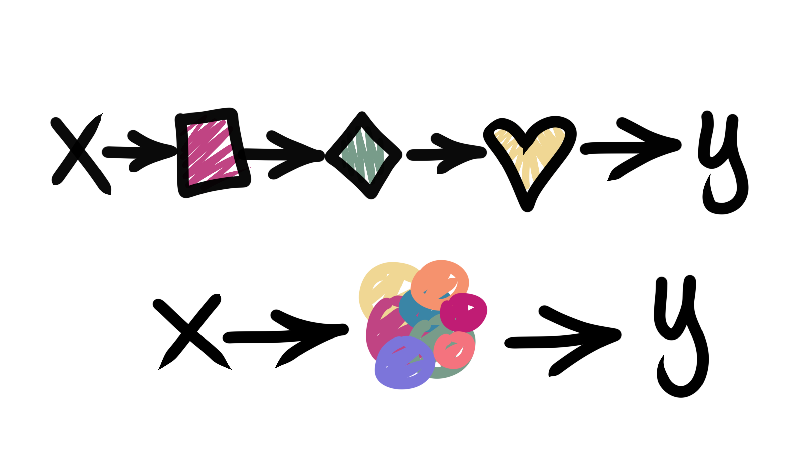
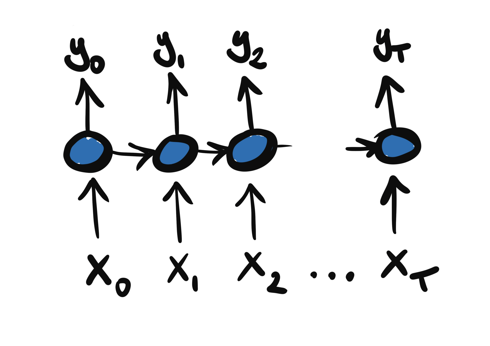
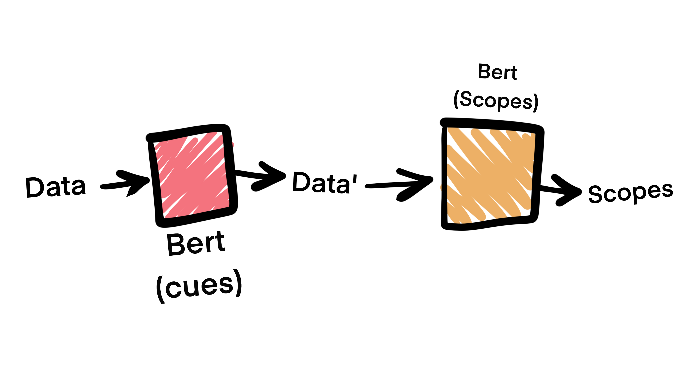

<!--- _class: invert --->
<!--- _paginate: false --->
# End-to-end systems in Natural Language Processing
## 👩🏻‍🔬 🧠  NSR from feature extraction to Sesame Street
> **Emanuele Lapponi** (he/him)
> Language Technology Group
> Institute for Informatics
> University of Oslo
> `@emanlapponi`

---
## 🤔 From-what-end-to-what-end NLP systems? And through what?

- Depends where you are starting from! Text? Speech? A picture, maybe?


---

# <!--- fit ---> End-to-end models

- (a) From separate models (and feature "design")
- (b) To separate neural models
- (c) To one neural model



<!--- _footer: '[Navdeep Jaitly, CS2249](https://youtu.be/3MjIkWxXigM)' --->

---
# ⚗️ End-to-end NLP research

<!---
- NLP systems to advance the state of the art in NLP
    - Question answering `(question,text) -> offsets`
    - Sentiment analysis `text -> sentiment`
    - Named entity recognition `text -> (label,offsets)`
-->

- Is SOTA is moving towards end-to-end learning?
- Today: NLP systems from 2012 to 2019, with Negation scope resolution


---
# 🕵🏻‍♂️ 🔎 Negation Scope Resolution (NSR)

> Given a sentence and a negation cue (**not**, -**less**, **without**), which tokens are negated?

- If **{** he was **}** in the hospital and yet **not** **{** on the staff **}** he could only have been a house-surgeon or a house-physician.

- ... and **no** **{** one could have escaped our notice **}**.

---
# 🕵🏻‍♂️ 🔎 Negation Scope Resolution (NSR)

One way to think about it:

```txt
...
and     O
no      CUE
one     NEGATED
could   NEGATED
have    NEGATED
escaped NEGATED
our     NEGATED
notice  NEGATED
.
```

<!--- _footer: '* Arguably, deep semantic parsing is a better fit 🤔: Packard et al. 2014. But it is detrimental to our story line, and time is of the essence 😅 ❤️' --->

---
<!--- _class: invert --->
<!--- _paginate: false --->

## <!--- fit ---> 2012


---

# 👩🏻‍🔬 UiO2: Sequence-Labeling Negation with Dependency Features
> ###### Lapponi et al., 2012

- A Highly (over?) engineered system
- Uses the most fashionable tool of the time: CRFs
- But everyone has CRFs! What matters most here (and,  arguably, in NLP in general) is representation.

---

# What's a word?

A bunch of symbols! we decide what those symbols are, for instance:
- token `notice`
- part-of-speech disambiguated: `notice-NOUN`
- the backward trigram: `notice-our-escaped`
- might help to know that it's a direct object: `notice-dobj`

---

# What's the effect of a negation cue?

The same as a normal word, but also:
- a right/left distance from a negation cue: `5`
- in a syntax (dependency) tree, a shortest path: `3`
- and a very specific symbol to represent it: `UP-dobj-DOWN-nsubj-DOWN-dep`
- Very, very sparse matrix


---

# Then, give the matrix to the model

Without diving into the specific, for intuition's sake:


### Ah ha! One more thing

Since the transitions have an effect on the model, experiment with more labels:
`[O, MCUE, CUE, N, S]` - perhaps counterintuitive, but does the trick

---
> (a), different non-neural models/components  
>  


---
# Where does it get us?

- The best CRF feature soup for negation in general, and the best system for exact scope match :tada:

|   	      | Scope tokens F1	| Exact scope F1|
|:----------: |----------------:|-------------:|
| UiO2  	  | **83.73**       | **72.39**    |
| UWashington | 83.51           | 71.81        |

... by a quite small margin 🎚

<!--- _footer: '😅 Abridged leaderboard, considering only CRF approaches and not sorting according to other evaluation dimensions.' --->

---
<!--- _paginate: false --->

## <!--- fit ---> 2013


---

# Representation revisited

- All the engineering in the 2012 system gets us little in the way of actual **meaning**
- Sherlock Holmes is a detective, and a fictional one at that
- How shall we know the meaning of a word, Prof. Firth?

---


# <!--- fit ---> You shall know a word by the company it keeps


---

# Word vectors

- Randomly initialize one vector per word
- Calculate a probability distribution of surrounding words (or the inverse)


---
# 🤯🤯🤯

**Good at capturing similarities/concepts**
```python
e.most_similar('sherlock_holmes')[:3]

# [('hercule_poirot', 0.808704137802124),
#  ('miss_marple', 0.7863813638687134),
#  ('fictional_detective', 0.7675886154174805)]
```
**Semantic algebra! Linguistic properties!**
```python
good = e['good']
better = e['better']
fast = e['fast']
e.most_similar(
    [better - good + fast]
)[0]

# ('faster', 0.7491286396980286)
```

---

# LSTMs dominate NLP

- A sequential model
- Learn task-specific contextual features
- Good at capturing long distance dependencies

**For example**
```python
X = [e['no'], e['one'], e['cares'], e['.']]
y = [[0,1], [1,0], [1,0], [0,1]]
```



---
<!--- _paginate: false --->
<!--- _class: invert --->

## <!--- fit ---> 2016


---

# 🧠 Neural Networks For Negation Scope Detection
> ###### Fancellu et al., 2016

- **Bidirectional** LSTMs seem to be a "natural" fit for negation
    - Scopes can be either to right or left of a cue, discontinuous scopes, etc.
- Unsupervised token modeling
- Semi-supervised **pos** modeling
- No explicit feature modeling of the relation between cues and tokens

---

> (b), different neural models/components  
>  


---

# Less "intervention" _and_ better performance :moneybag: 📈

|   	      | Scope tokens F1	| Exact scope F1|
|:----------: |----------------:|--------------:|
| BiLSTM      | **88.72**       | **77.77**     |
| UiO2  	  | 83.73           | 72.39         |
| UWashington | 83.51           | 71.81         |

---

# Less "intervention" ~~_and_ better performance~~ 🤦🏻‍♂️

|   	      | Scope tokens F1	| Exact scope F1|
|:----------: |----------------:|--------------:|
| BiLSTM      | (?) **88.72**   | (?) **77.77** |
| UiO2  	  | 83.73           | 72.39         |
| UWashington | 83.51           | 71.81         |

---
<!--- _paginate: false --->
<!--- _class: invert --->

## <!--- fit ---> 2018


---

# The problem with word vectors


---

#  Deep contextualized word representations
> Peters et al., 2018

- Instead of pre-training fixed dictionaries of WV, pre-train a deep biLSTM instead
- Run text through the pre-trained network, and out come the representations
- The promise: swap your WVs with Elmo embeddings, and performance will improve

---

#  In practice

```python
e = embed(
    "interest rates are subject to fluctuation without notice".split(),
    "we have yet to receive formal notification of the announcement".split(),
    "notice the youth behaving suspiciously".split(),
    "she observed that all the chairs were already occupied".split(),
)
 
notice_announcement = e[0][7]
announcement = e[1][9]
notice_observe = e[2][0]
observe = e[3][1]


print(all([
    1-cosine(notice_announcement, announcement) > 1-cosine(notice_announcement, observe),
    1-cosine(notice_observe, observe) > 1-cosine(notice_announcement, observe)
]))

# > True
```

---

# <!--- fit --->  BERT: Pre-training of Deep Bidirectional Transformers for Language Understanding
> Devlin et al. 2019

- The same general intuition as Elmo, but with a **transformer** architecture
- Ditches the recurrent part of Elmo, enables training massive models
- multi-head attention and transformer probing is a genre in itself
- Gets us closer to **end-to-end**(-ness?): fine-tuning

---

# Model fine-tuning

- More than just representation: add a layer for your task
- Gently (and cheaply!) retrain the whole network
- Text in, English SOTA out
- Made easily accessible by for example 🤗


---

<!--- _paginate: false --->
<!--- _class: invert --->

## <!--- fit ---> 2019


---

#  NegBERT A Transfer Learning Approach for Negation Detection and Scope Resolution
> ###### Khandelwal and Sawant, 2019*

- Gets us even closer to end to end:
    1. Fine-tune Bert for cue detection
    2. Fine-tune Bert for scope detection (w/ special cue tokens)
- Features-through-labels make a comeback!
 `['normal', 'affix', 'multiword', 'not-a-cue']`


<!--- _footer: '* Preprint on arXiv November 2019' --->

---

>_Almost_ (c), one neural model
> 
 



---

#  🏆

|             | Scope tokens F1	| Exact scope F1|
|:----------: |----------------:|--------------:|
| NegBERT     | **92.36**       | ---           |
| BiLSTM      | (?) 88.72       | (?) 77.77     |
| UiO2  	  | 83.73           | 72.39         |
| UWashington | 83.51           | 71.81         |


---

# 🧶 In short

- End to end systems in NLP: from pipelines, through neural pipelines, to one neural model
- We took a historical, research-based look at this trend through architectural developments in a specific task: NSR
- Almost there but not quite!
